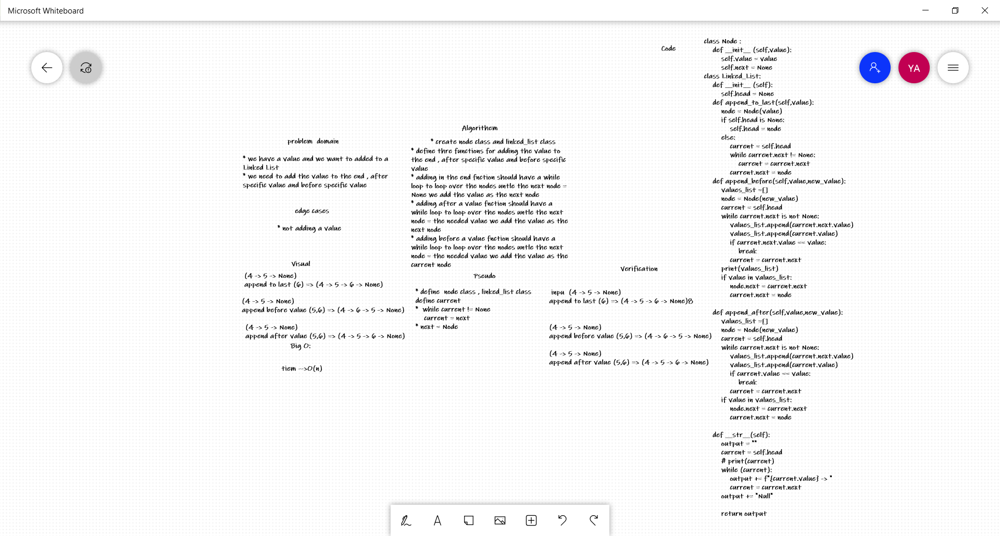

# Linked List challenge

## Challenge Summary
writing functions and classes to allow the user to put the node after or before a spicitic value and at the end of the linked list

## Approach & Efficiency
- The program is working fine all the needed got achieved  
- big-O = O(n)

## Solution
1. if we used Linked_List.append_to_last(value) it will add the value to the end 
1. if we used Linked_List.append_before(value, new_value) it will add the new_value before the value  
1. if we used Linked_List.append_after(value, new_value) it will add the new_value after the value  

## Whiteboard Process
