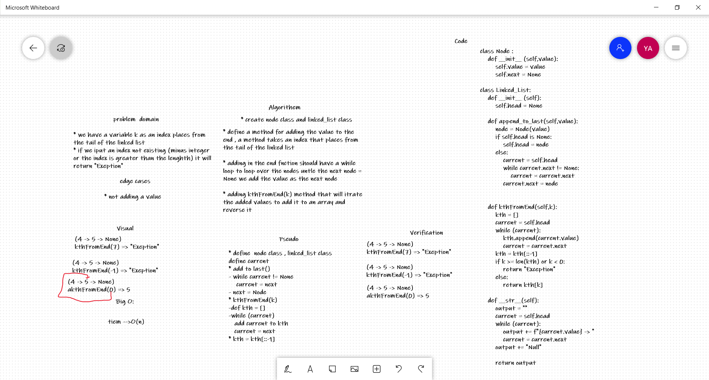

# value from the end of a Linked List challenge

## Challenge Summary
writing classes and methods to Return the node’s value that is **k** places from the tail of the linked list.

## Approach & Efficiency
- The program is working fine all the needed got achieved  
- big-O = O(n)

## Solution
 if we used Linked_List.kthFromEnd(k) it will Return the node’s value that is **k** places from the tail of the linked list.
  

## Whiteboard Process
