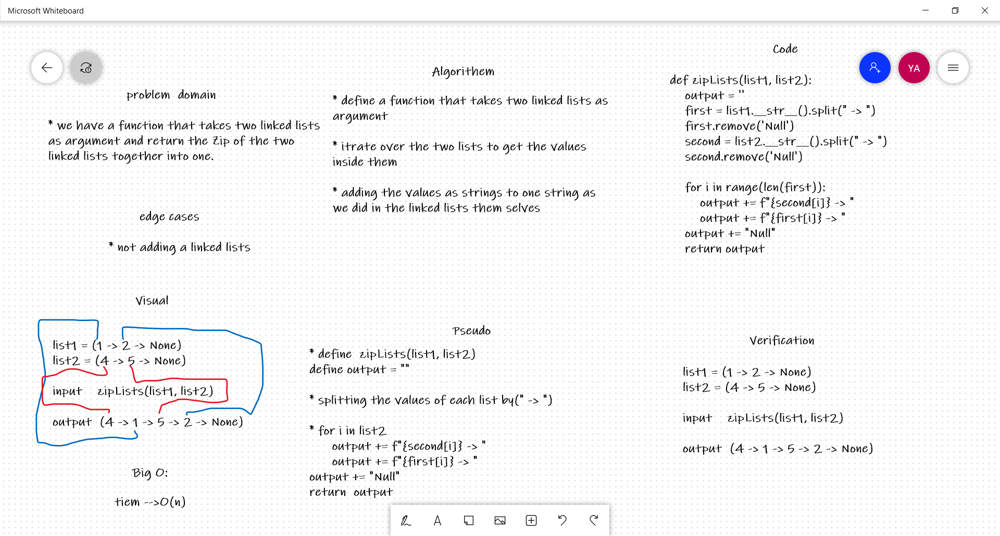

# Zip two linked lists challenge

## Challenge Summary
writing a function that takes two linked lists as argument and return the Zip of the two linked lists together into one.

## Approach & Efficiency
- The program is working fine all the needed got achieved  
- big-O = O(n)

## Solution
 if we used zipLists(list1, list2) it will return the Zip of the two linked lists together into one.
  
## Whiteboard Process
