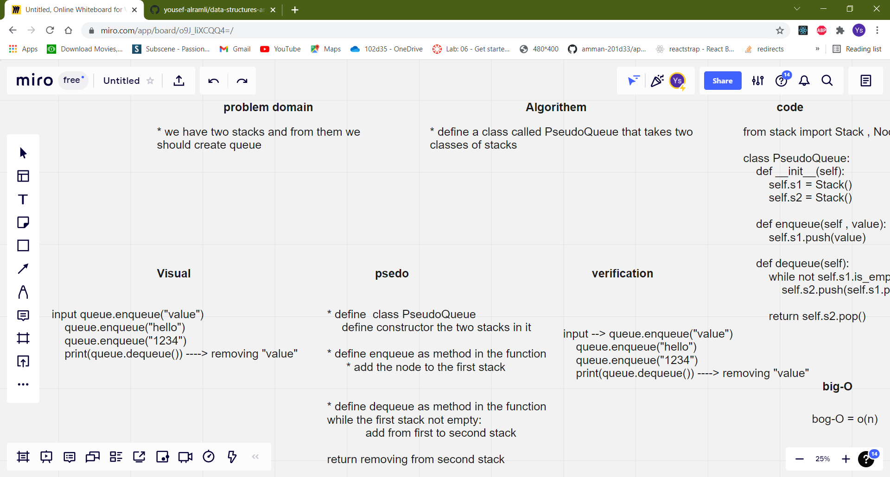

# Pseudo Queue

## Challenge Summary
writing a Pseudo Queue class that take two stacks and make from it queue

## Approach & Efficiency
- The program is working fine all the needed got achieved  
- big-O = O(n)

## Solution
 if we used PseudoQueue class and added nodes from it it will return it as queue 
  
## Whiteboard Process
