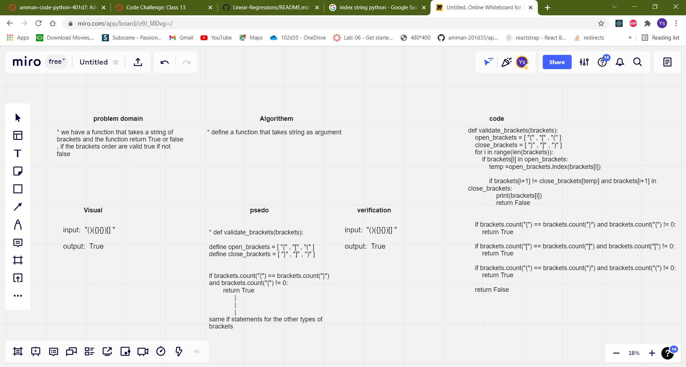

# Multi-bracket Validation.

## Challenge Summary
writing function that takes a string of brackets and the function return True or false , if the brackets order are valid true if not false

## Approach & Efficiency
- The program is working fine all the needed got achieved  
- big-O = O(n)

## Solution
 if we used validate_brackets(brackets) it will return true or false depending on the validation of the brackets
  
## Whiteboard Process
