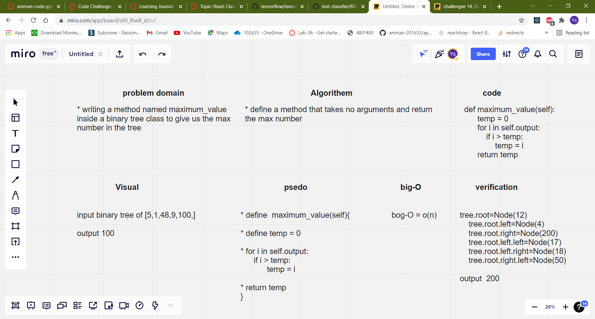

# Trees

## Challenge Summary
making tress in pre order, in order, and post order 

## Approach & Efficiency
- The program is working fine all the needed got achieved  
- big-O = O(n)

## whiteboard
