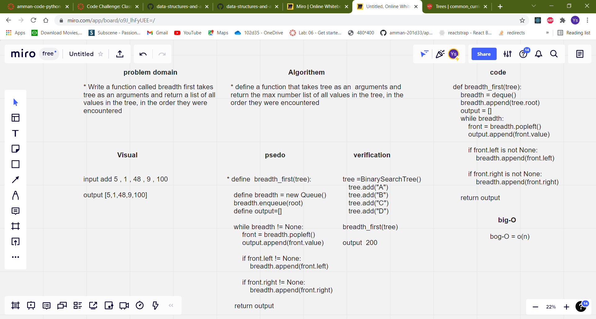

# Trees

## Challenge Summary
Write a function to return list of all values in the tree, in the order they were encountered

## Approach & Efficiency
- The program is working fine all the needed got achieved  
- big-O = O(n)

## whiteboard
