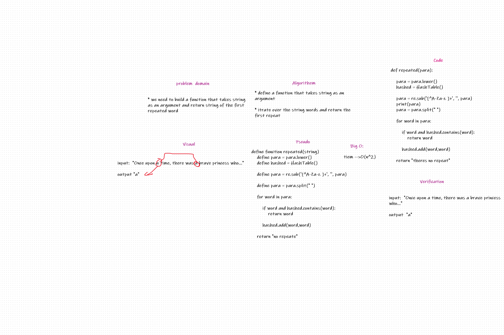

# Challenge Summary
Taking a string and itrate over the wordes and return the first repeated word as string.

## Whiteboard Process

## Approach & Efficiency
- The program is working fine all the needed got achieved  
- big-O = O(n) 

## Solution
creating function called repeated takes string as an arguments to return first repeated word.
