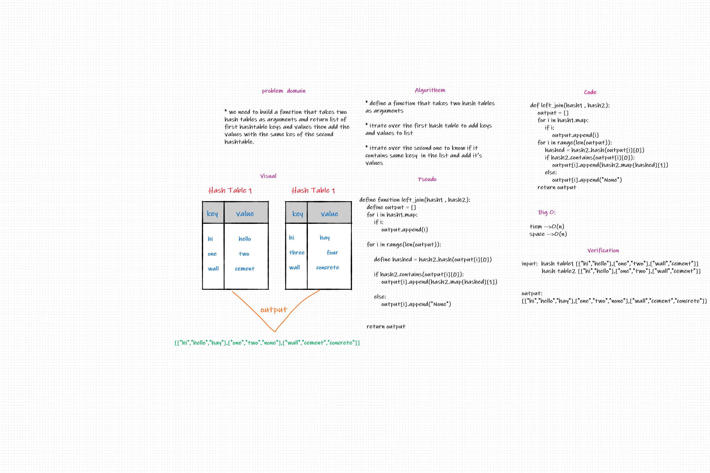

# Challenge Summary
Taking two hash tables as arguments and return list of first hashtable keys and values then add the values with the same kes of the second hashtable.

## Whiteboard Process

## Approach & Efficiency
- The program is working fine all the needed got achieved  
- big-O = O(n) times
- big-O = O(n) space

## Solution
creating function called left_join hash tables as arguments and return list of first hashtable keys and values then add the values with the same kes of the second hashtable.