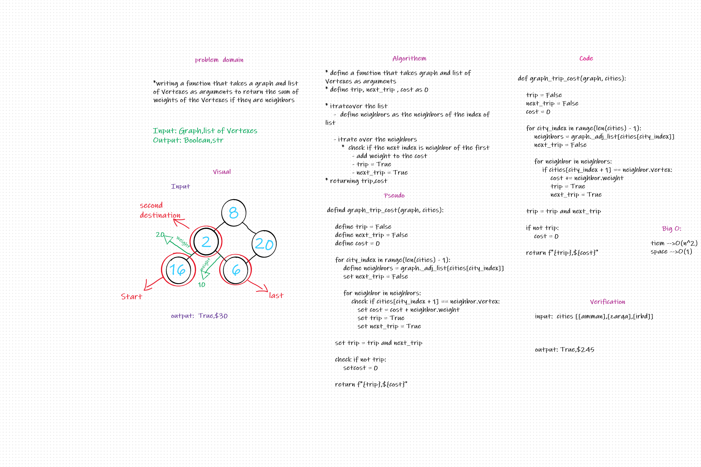

# Challenge Summary
Given a business trip itinerary, and an Alaska Airlines route map, is the trip possible with direct flights? If so, how much will the total trip cost be?

## Whiteboard Process

## Approach & Efficiency
- The program is working fine all the needed got achieved  
- big-O = O(n^2) time
- big-O = O(1) space

## Solution
creating function called graph_business_trip() takes graph and list of cities as arguments to return boolean if the trip possible,If it is write the cost  .
