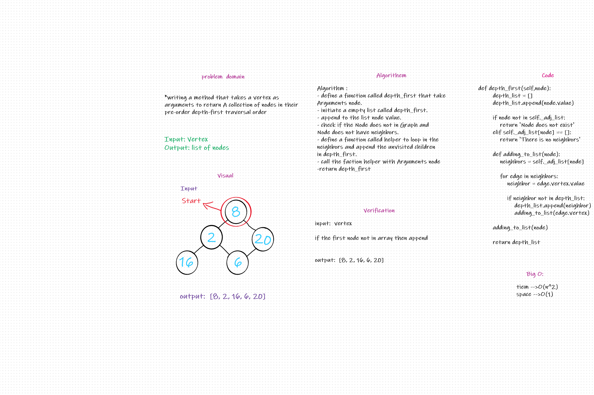

# Challenge Summary
Conduct a depth first preorder traversal on a graph.

## Whiteboard Process

## Approach & Efficiency
- The program is working fine all the needed got achieved  
- big-O = O(1) time
- big-O = O(n) space

## Solution
creating method called depth_first() takes vertex as arguments to return boolean if the trip possible,If it is write the cost  .
